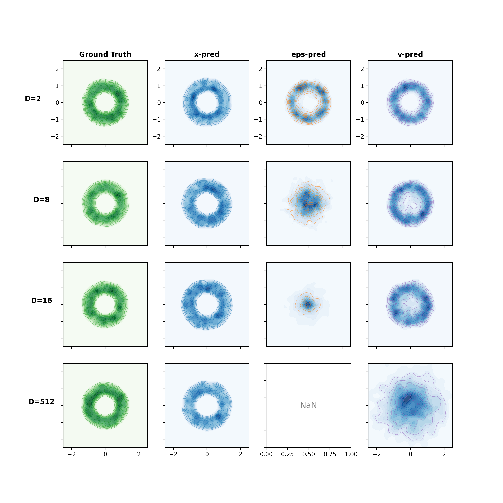
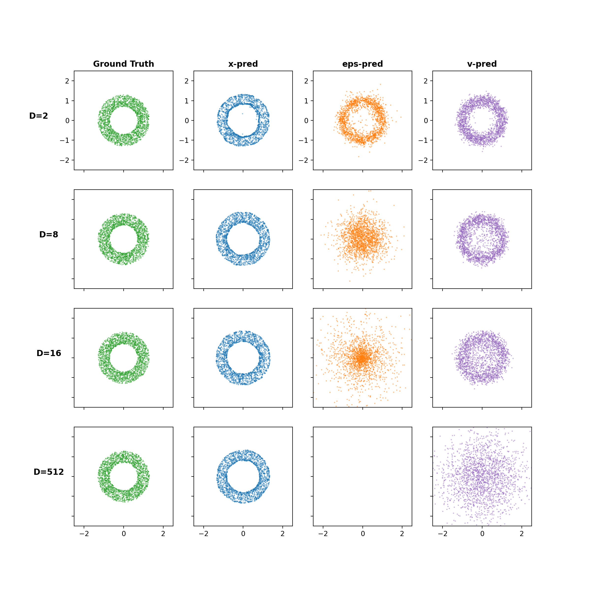

# Toy Experiment: Reproducing Figure 2 of "Back to Basics"

> Paper: [Back to Basics: Let Denoising Generative Models Denoise](https://arxiv.org/abs/2511.13720v2)

## 实验目的

复现论文 Figure 2 的 Toy Experiment，验证核心论点：**当观察维度 D 远高于数据流形维度 d 时，只有 x-prediction（直接预测干净数据）能成功生成，而 ε-prediction 和 v-prediction 会崩溃。**

## 核心思路

根据流形假设 (manifold assumption)，自然数据位于低维流形上，而噪声 ε 和速度向量 v 是 off-manifold 的：

- **x-prediction**: 网络直接预测干净数据 x，目标隐式是低维的，即使模型 under-complete 也能工作
- **ε-prediction**: 网络预测噪声，需要保留高维信息，容量不足时失败
- **v-prediction**: 网络预测速度 v = x - ε，同样需要高维容量

## 实验设置

### 数据分布

- **Ground Truth**: 空心圆环 (ring)，半径 r=1.0，宽度 width=0.3
- **内在维度** d = 2
- **观察维度** D ∈ {2, 8, 16, 512}

### 投影

通过固定随机列正交矩阵 P ∈ R^{D×d} 将 d 维数据投影到 D 维空间：

```
x = x_hat @ P^T    (D维观察数据)
```

可视化时反向投影：`samples_d = z @ P`（P 对模型未知）

### 模型

5 层 ReLU MLP，256 维隐藏层（与论文一致）：

```
[D+1] → [256] → [256] → [256] → [256] → [256] → [D]
         ReLU    ReLU    ReLU    ReLU    ReLU
```

### 训练

| 参数 | 值 |
|------|------|
| 损失函数 | v-loss (所有三种预测目标) |
| 时间调度 | z_t = t·x + (1-t)·ε |
| t 采样 | Uniform, clamped to [0.01, 0.99] |
| 优化器 | AdamW (lr=2e-4, weight_decay=1e-5) |
| 学习率调度 | CosineAnnealing |
| 梯度裁剪 | max_norm=1.0 |
| Epochs | 5000 |
| Batch size | 512 |

### 采样

50 步 Heun solver（2 阶 ODE 求解器），从标准高斯噪声出发，积分至 t=1。

### 三种预测目标的 v-loss 公式

| 预测目标 | v_θ 计算方式 | 等效重加权 |
|----------|-------------|-----------|
| x-pred | v_θ = (x_θ - z_t) / (1-t) | x-loss × 1/(1-t)^2 |
| ε-pred | v_θ = (z_t - ε_θ) / t | ε-loss × 1/t^2 |
| v-pred | v_θ = output (直接) | v-loss (无重加权) |

## 结果

### 训练 Loss

| D | x-pred | ε-pred | v-pred |
|---|--------|--------|--------|
| 2 | 1.07 | 1.01 | 1.10 |
| 8 | 0.26 | 0.65 | 0.28 |
| 16 | 0.14 | 0.83 | 0.16 |
| 512 | **0.004** | **215.1** | **0.83** |

### 生成样本统计（投影回 2D 后的半径）

| D | x-pred | ε-pred | v-pred | GT |
|---|--------|--------|--------|-----|
| 2 | 1.04±0.18 | 0.99±0.19 | 1.00±0.17 | 1.0 |
| 8 | 1.08±0.18 | 0.75±0.41 | 0.98±0.23 | 1.0 |
| 16 | 1.10±0.18 | 0.93±0.79 | 0.96±0.26 | 1.0 |
| 512 | **1.08±0.18** | **1256±632** | **1.25±0.66** | 1.0 |

### 可视化结果

#### KDE 密度图（正确版本）



#### Scatter 散点图



### 关键观察

1. **D=2**: 三种方法均可生成圆环（容量充足）
2. **D=8**: ε-pred 开始退化（半径偏小 0.75，方差增大）
3. **D=16**: ε-pred 明显退化；v-pred 略有偏差
4. **D=512**: x-pred 仍完美（半径 1.08），ε-pred 彻底崩溃（半径 1256），v-pred 严重模糊（半径 1.25±0.66）

这与论文结论完全一致：**在 256 维隐藏层的 MLP 中，D=512 时模型是 under-complete 的（256 < 512），但 x-prediction 因其低维目标仍然有效，而 ε/v-prediction 因需要表达高维信息而失败。**

## 文件结构

```
JIT_toy/
├── create_figure2.py          # 主脚本（训练 + 采样 + 保存模型）
├── redraw_figure2.py         # 重绘脚本（加载模型 + KDE 可视化）
├── toy_experiment_README.md  # 本文档
├── toy_results/
│   ├── figure_2_kde_v2.png    # KDE 密度可视化（正确版本）
│   ├── figure_2_kde.png      # KDE 密度可视化（旧版本）
│   ├── figure_2_scatter.png  # 散点图可视化
│   └── model_D{D}_{pred_type}.pt  # 训练保存的模型权重 (12个)
└── 2511.13720/               # 论文资源（源码、图片等）
```

## 运行

### 方式一：完整训练 + 绘图

```bash
python3 create_figure2.py
```

输出：
- 模型权重：`toy_results/model_D{D}_{pred_type}.pt`
- KDE 图：`toy_results/figure_2_kde.png`
- 散点图：`toy_results/figure_2_scatter.png`

运行时间约 3-5 分钟（GPU）。

### 方式二：仅重绘 KDE 图（从保存的模型）

```bash
python3 redraw_figure2.py
```

输出：`toy_results/figure_2_kde_v2.png`（使用 scipy KDE 正确渲染）

## 模型权重说明

训练过程中会自动保存 best model（最低 loss 时刻的模型）：

| 文件名 | D | 预测类型 | 描述 |
|--------|---|----------|------|
| model_D2_x.pt | 2 | x-pred | 正常 |
| model_D2_eps.pt | 2 | ε-pred | 正常 |
| model_D2_v.pt | 2 | v-pred | 正常 |
| model_D8_x.pt | 8 | x-pred | 正常 |
| model_D8_eps.pt | 8 | ε-pred | 退化 |
| model_D8_v.pt | 8 | v-pred | 正常 |
| model_D16_x.pt | 16 | x-pred | 正常 |
| model_D16_eps.pt | 16 | ε-pred | 明显退化 |
| model_D16_v.pt | 16 | v-pred | 略有偏差 |
| model_D512_x.pt | 512 | x-pred | **完美** |
| model_D512_eps.pt | 512 | ε-pred | **崩溃** |
| model_D512_v.pt | 512 | v-pred | 模糊 |